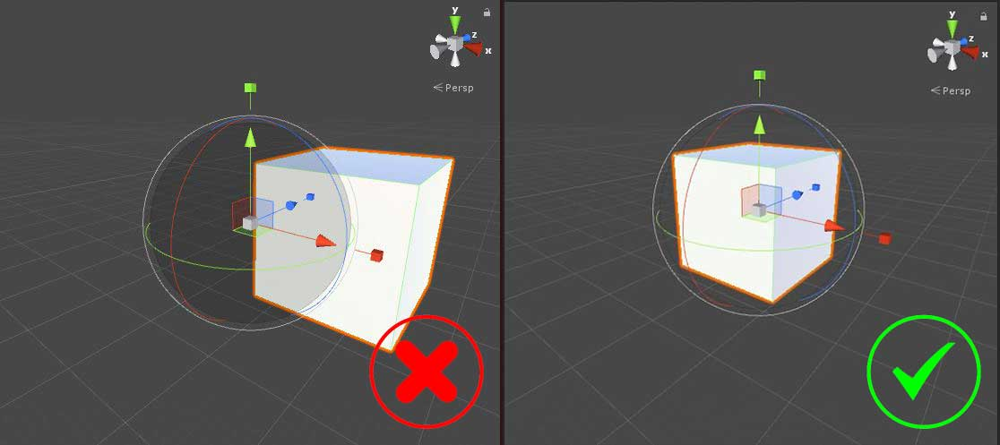
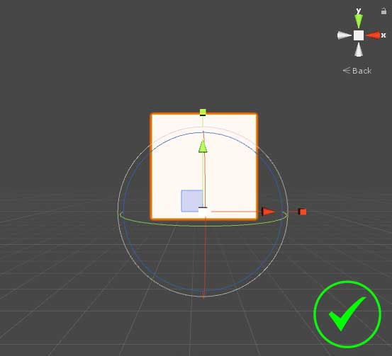
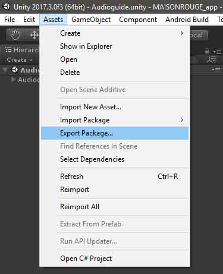
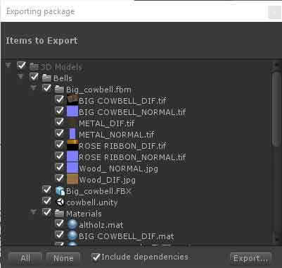
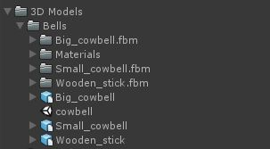

# 3D Assets Best Practices

## Table of Contents

1. [Introduction](#introduction)
2. [Pivot Point](#pivot-point)
3. [Unity Package](#Unity-Package)
4. [Hierarchy](#hierarchy)

## Introduction

## Pivot Point

It's mandatory to check the good positioning of the pivot point for each asset. The pivot point should be in the center of the mesh and in no case outside of it. See the example bellow:

In certain cases, you can move the pivot point at the bottom of the object. It can be useful if we need to position it on a surface later. For example, a plate should have its pivot point at the bottom because in the end, it will be positioned on a table. See the example bellow:

## Unity Package

One way to facilitate importation is to create a Unity Package of your assets. Your need to launch the version used for the project _(ex: Unity 2018.1.1)_ and then import your model in Unity (simply drag and drop the .FBX file in the unity's __Project__ window).

Here, you can now drag and drop the model from the __Project__ window into the __Scene__ window and check if everything is ok (textures, UVs, pivot points, etc...).

If everything is fine, you can export your asset. Simply click on the root folder containing your 3D model and textures and go to __Assets -> Export Package...__ (top menu). Check if everything you need is in the list and hit __Export...__ . Name it, click __Save__ and you're done!

## Hierarchy

When exporting a UnityPackage it's important to organised the hierarchy of the file correctly. 
In general, you should follow this pattern :

->3D Assets (folder)  
-->*Name of your file* (ex: *Bells*) (folder)  
--->Your content (folder or file)  
--->Your content (folder or file)  
--->Your content (folder or file)  

In Unity, it should looks like this: 

