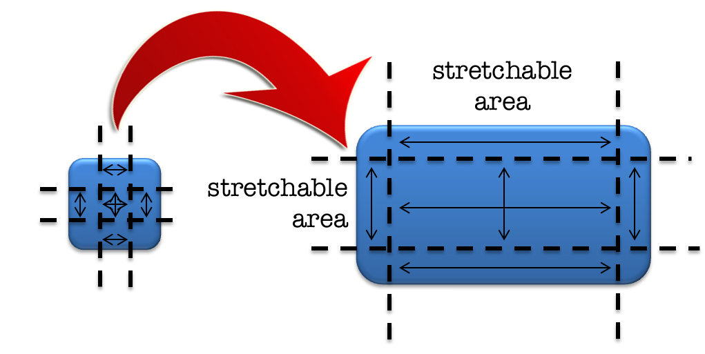
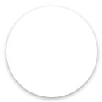
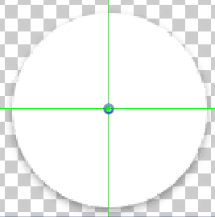
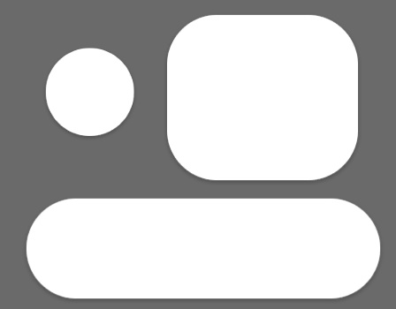
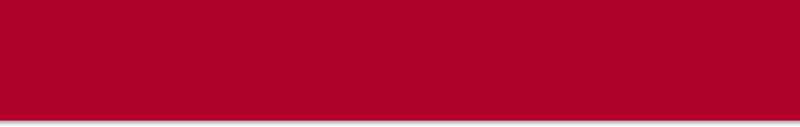
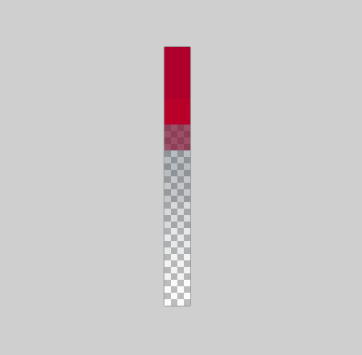
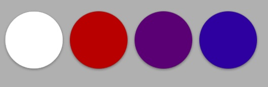
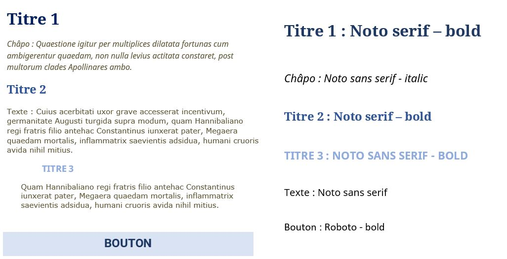

# Graphic Design Best Practices

## Table of Contents

 1. [Introduction](#introduction)
 1. [Resources](#resources)
 1. [Assets with transparency](#assets-with-transparency)
 1. [9-Slice](#9-slice)
 1. [Repetitive or stretchable images](#repetitive-or-stretchable-images)
 1. [Assets with the same shape and different colors](#assets-with-the-same-shape-and-different-colors)
 1. [3D Assets](#3d-assets)
 1. [Fonts](#fonts)

## Introduction

Here are some best practices that should be followed when working on a Unity Project.

If you have any question or if something is not clear enough, you can create an issue in this repository.

## Resources

When using images and assets from another website, make sure that the licence linked with this asset is free to use for commercial use.

For generic icons, it is recommanded to look at the [Material Icons](https://material.io/icons/) made by Google.

## Assets with transparency

When working with assets that have transparency, it is often a best practice to crop the image and discard most of the transparent pixels. In most cases it is useful to leave a line or a column of 2 pixels at the image border. It prevents cutting too many pixels (that often happens when working with rounded shape or images with shadows).

## 9-Slice

When applicable it is always prefered to prepare an asset with a 9-slice approach. it gives us flexibility and ways to use the same assets without too much memory consumption.

Buttons can often be cut with a 9-slice approach, has they often have stretchable areas.

Here is an example applied to a circle (the stretchable area is 0-pixel wide, making it appear 4-sliced). The first image is the original one. The seconde image is what it looks like in the tool provided by Unity to slice the image. The Third one shows some examples of application in Unity. Keep in mind that that same image is used for all three shapes, and Unity stretches them correctly following the slices.

  

## Repetitive or stretchable images

if an image is *repetitive* either in width or height, it is best practice to reduse its size to the minimum. To explain this better, here is an example.

1. We want to use this image for a header menu in one of our application:

2. To optimize the memory consumption we can reduce its width to 1 pixel, because the image is the same on all its width. In Unity we can stretch this image without losing any details. Here is the result:

3. We can improve this by applying a 9-slice approach. The red area is stretchable, so we can get rid of most of it.

We started with a 800x127 resolution and ended with a 1x10 resolution. Significantly reducing its memory size. Here is the last image zoomed in to see the detail :

## Aspect Ratios

We often make application for multiple devices that have different resolution and aspect ratio. It is best to keep that in mind when making assets that should appear on the whole screen. The most common aspect ratios are : 16:9, 16:10 and 4:3.

When we want the application to be compatible with theses aspect ratios, the best approach for this is to make one big image (usually in a 1:1 or 4:3 aspect ratio). Unity will automatically crop this image (keep in mind that most of the image will be discarded when viewed on a 16:9 screen).

## Assets with one color and no transparency

If every pixel of an image is the same color, we don't need an asset for this. Only the RGB or the Hexadecimal decimal code that describe this color. It might be wise the put these colors in a text file ("color_palette.txt" for example).

## Assets with the same shape and different colors

Unity gives us the tool to modify the color of an image directly, without modifying the original file. With a white image, we only need the color code (rgb or hexadecimal) to change its color. Here is a screenshot from Unity to illustrate this :

In this example we used only one image: the white circle with the shadow. Its color is changed with the Image Component in Unity. An important thing to notice is that it changed only the white circle, and the shadows remained black.

This work best if the image only has one color (white). It can also works with a black gradient, as illustrated before.

## 3D Assets

Unity published an [Asset Best Practice guide](https://docs.unity3d.com/Manual/HOWTO-ArtAssetBestPracticeGuide.html) in its manual. It is a good starting point for 3D assets.

## Fonts

We need source files of all fonts used in the application, in .ttf or .otf and a guide line indicated which font is used for each title / texts /button /menu /etc. Example :

